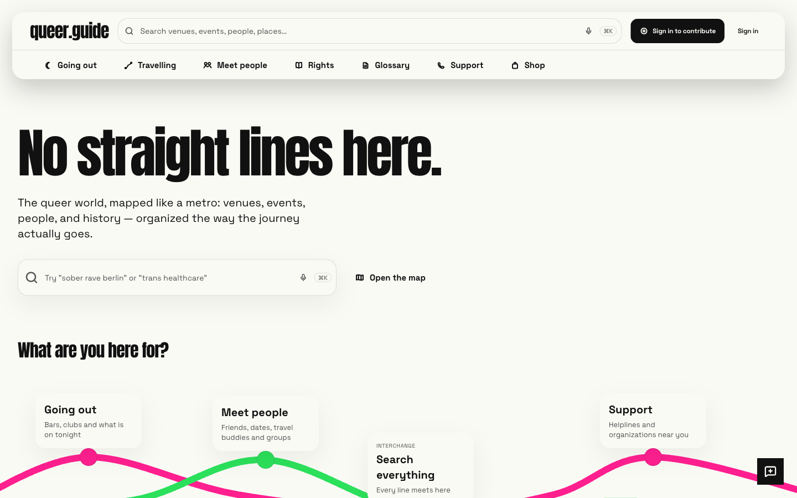

# Queer Guide

**[🌐 Live → queer.guide](https://queer.guide)**



The global platform for LGBTQ+ travel, community, and safe spaces at [queer.guide](https://queer.guide).

## Tech Stack

| Layer              | Stack                                                                                                                                                                                    |
| ------------------ | ---------------------------------------------------------------------------------------------------------------------------------------------------------------------------------------- |
| **Frontend**       | React 19, Vite 8, TypeScript 5.9, Tailwind CSS 4, shadcn/ui                                                                                                                              |
| **Routing & Data** | React Router 8, TanStack Query + Table + Virtual                                                                                                                                         |
| **Backend**        | Supabase (PostgreSQL 17.4, Auth, Storage, Edge Functions)                                                                                                                                |
| **Hosting**        | Cloudflare Pages + Cloudflare Workers                                                                                                                                                    |
| **Search**         | Postgres `search_documents` (hybrid keyword + `vector(1024)` semantic + PostGIS geo), served by the `search-proxy` CF Worker, CF Workers AI (bge-m3 embeddings, reranker) via AI Gateway |
| **Maps**           | MapLibre GL 6, Protomaps basemaps, Mapbox geocoding (frontend), Photon/Nominatim (pipelines)                                                                                             |
| **AI**             | Cloudflare Workers AI (llama-3.3-70b enrichment, llama-3.1-8b relevance gating, bge-m3 embeddings); OpenAI `gpt-4o-mini` as the legacy fallback path (`USE_OPENAI=1`)                    |
| **Workflows**      | pgmq + `workflow-dispatcher`, `admin_automations` registry + pg_cron                                                                                                                     |
| **Payments**       | Stripe                                                                                                                                                                                   |
| **i18n**           | i18next — 11 languages (ar, de, en, es, fr, it, ja, ko, pt, ru, zh)                                                                                                                      |
| **Editor**         | Tiptap                                                                                                                                                                                   |
| **Monitoring**     | Sentry, Umami (self-hosted)                                                                                                                                                              |

## Project Structure

```
src/                       # React app (~280 pages, feature-grouped components)
supabase/
├── functions/             # 220 Deno Edge Functions
└── migrations/            # 1,255 PostgreSQL migrations
functions/                 # Cloudflare Pages Functions (edge middleware, sitemaps, bot SEO)
workers/
├── assistant/             # CF Worker: conversational concierge (Durable Object + tool loop)
├── extract/               # CF Worker: server-side URL → markdown extraction
├── image-cdn/             # CF Worker: image transform + cache layer
├── image-ingest/          # CF Worker: image mirror/dedup → R2
├── ingest/                # CF Worker: embedding drain for search
├── search-proxy/          # CF Worker: search read path over Postgres RPCs
├── snapshot-archiver/     # CF Worker: admin/editorial snapshot archival
├── submit/                # CF Worker: extension submissions → ingestion_staging
├── team-inbox/            # CF Worker: team inbox ingestion
├── travel-inbox/          # CF Worker: travel inbox ingestion
└── trip-inbox/            # CF Worker: trip-planning inbox ingestion
scraper/                   # Node.js scraping pipeline (Cheerio + Playwright)
extension/                 # Chrome extension (MV3, React 19) — user venue/event submissions
e2e/                       # Playwright E2E tests (86 specs)
scripts/                   # Operational scripts
docs/                      # Architecture docs, ADRs, runbooks
.github/workflows/         # GitHub Actions (CI, deploy, crons, nightly e2e, data-quality gates)
```

## Local Development

Requirements: Node.js 22+, npm.

```sh
npm install                       # .npmrc sets legacy-peer-deps
npm run dev                       # port 8080
```

| Script                        | Purpose                                                      |
| ----------------------------- | ------------------------------------------------------------ |
| `npm run dev`                 | Vite dev server (port 8080)                                  |
| `npm run build`               | Production build → `dist/`                                   |
| `npm run lint`                | ESLint                                                       |
| `npm test`                    | Vitest (`src/**`)                                            |
| `npm run test:functions`      | Deno tests for `supabase/functions/**`                       |
| `npm run typecheck`           | tsc against a recorded baseline — fails only on _new_ errors |
| `npm run typecheck:functions` | tsc for `functions/` (zero-tolerance gate)                   |

A root `Makefile` provides cross-package convenience targets (`make install`, `make build`, `make test`, `make lint`).

Sub-packages have their own `package.json`:

- `scraper/` — `cd scraper && npm install && npm test`
- `extension/` — `cd extension && npm install && npm run build`
- `workers/*` — each uses `wrangler dev` / `wrangler deploy`

## Architecture

### Search

Hybrid (keyword + semantic) personalized search with reranking, served entirely from Postgres.
See [SEARCH_SYSTEM.md](SEARCH_SYSTEM.md) and `workers/search-proxy/README.md`.

```
Frontend ──► search-proxy (CF Worker)
                ├── AI Gateway → Workers AI (bge-m3 embed + reranker)
                └── Supabase RPCs (search_hybrid / search_facets / search_autocomplete)
                        over the denormalized search_documents table

Supabase ──entity writes──► search_reindex_queue ──drain (1/min)──► search_documents
workers/ingest ──*/5 drain──► content_embeddings ──trigger──► search_documents.embedding
```

Indexed types: venues, events, cities, countries, news, marketplace, personalities, tags,
queer_villages, landmarks, organizations, groups, guides, milestones.

### Ingestion Pipelines

Two layers. `admin_automations` is the registry of record and pg_cron is the only scheduler;
the `ingestion_staging` state machine plus dual-mode `pipeline-*` stage functions and
`commit_*_staging_batch` SQL RPCs are the recurring engine. `pipeline-executor` + the admin
Builder remain the manual/on-demand tool.

```
source-* (data fetchers, with cheap prefilters)
  → pipeline-normalize
  → pipeline-extract / sanitize
  → pipeline-validate
  → pipeline-deduplicate
  → [LLM enrichment — gated, budgeted]
  → pipeline-quality-score
  → pipeline-review-gate
  → pipeline-commit
```

Cheap deterministic gates run before paid stages; LLM spend is centrally capped in `llm_budget`,
with `AI_DISABLED=1` as the hard kill switch. Queues: `scheduled_jobs`, `import_jobs`,
`content_processing`, `dead_letter` — exponential backoff retry, concurrency limits, idempotency keys.

**News** (hourly): RSS sources → sanitize → LLM enrichment (tags, summary, geo) → fingerprint dedup → commit. Source health auto-managed with exponential backoff and auto-pause at 8 consecutive failures.

**Marketplace** (daily, multi-source fan-in): Awin + Shopify + Etsy → Workers AI LGBTQ+ relevance gate → dedup → price-history tracking → image mirroring → embeddings. Weekly link-rot sweeper.

**User submissions** (Chrome extension): extracts structured data from any webpage via JSON-LD/microdata/OpenGraph/DOM heuristics → CF Worker stages into `ingestion_staging` → flows through the standard pipeline.

Observable at `/admin/pipelines` (Builder, Monitor, Sources, Staging, Dedup audit); health is gated
in CI by `scripts/check-pipeline-health.mjs`.

### Truth Engines

Content does not stop at ingest. Per-entity quality layers re-verify records continuously —
events (trust score, liveness, corroboration), venues (cross-source consensus + closure signals),
cities and countries (completeness + factual backfill), amenities, dedup, and personhood.
Each writes an append-only signal ledger, routes ambiguous decisions to an admin review queue,
and never auto-publishes a claim it cannot ground in a source.

### Auth & Safety

- Supabase Auth (email/password, OAuth, passkeys)
- Row-Level Security on all tables; admin via `admin_roles.canManageContent`
- **High-risk gating:** venues, events and organizations in criminalizing or death-penalty
  countries are visible only to signed-in users — enforced in RLS _and_ in the search proxy,
  which verifies the caller's JWT fail-closed
- Cloudflare Turnstile on public forms
- Audit logging for admin actions
- CSP (per-request nonce) / HSTS / X-Frame-Options

## Deployment

| Component      | How                                                                   |
| -------------- | --------------------------------------------------------------------- |
| Frontend       | Push to `main` → Cloudflare Pages auto-deploys                        |
| Edge functions | `supabase functions deploy <name> --project-ref xqeacpakadqfxjxjcewc` |
| Workers        | `wrangler deploy` from each worker directory                          |
| DB migrations  | Merged to `main` → CI `supabase db push`                              |
| Scraper        | GitHub Actions cron                                                   |

See `docs/runbooks/` for operational procedures (deploy, rollback, secret rotation, reindex, failed pipelines).

## Testing

| Type           | Tool                     | Run                      |
| -------------- | ------------------------ | ------------------------ |
| Unit/component | Vitest + testing-library | `npm test`               |
| Edge functions | Deno test                | `npm run test:functions` |
| E2E            | Playwright               | `npm run test:e2e`       |
| Types          | tsc (baseline ratchet)   | `npm run typecheck`      |
| Scraper        | Vitest                   | `cd scraper && npm test` |

E2E nightly at 03:00 UTC via GitHub Actions; i18n and a11y smoke tests on PRs touching relevant code.
Data-quality, pipeline-health, migration-drift and SEO gates run on their own schedules.

## Design

**Subway map system.** A paper card over a page-wide ground layer of the four track colors, ink
type, and four semantic "line" colors used for wayfinding — `--track-pink`, `--track-blue`,
`--track-green`, `--track-yellow`. Track colors are fill-only, never body text, never encode risk,
and always carry a 1px ink ring so contrast is satisfied fill-vs-ring. One accent per context;
the four only meet on network diagrams and the intersection gradient. Light + dark mode.

**Type:** Anton for display (96/76/52/32/20 px ladder), Space Grotesk for everything else.
Both self-hosted. Always use a size token — arbitrary `text-[NNrem]` is blocked by ESLint.

**Shape:** semantic radius — `rounded-panel` (26px, dialogs/sheets/page shells),
`rounded-container` (18px, cards), `rounded-element` (12px, buttons/inputs/rows),
`rounded-badge` (9px, chips). Nothing square. `rounded-full` for avatars and dots only.

**Surfaces:** containers carry no frame. A card reads by covering the ground layer plus one soft
elevation (`--shadow-soft`); borders survive only where WCAG 1.4.11 requires them — form controls,
the ring on a track-colored mark, and components whose edge _is_ the component.

**Spacing:** strict 8 pt grid — even-step Tailwind utilities only.

**Layout:** every page frames content with `<PageContainer>` (one gutter ladder, caps at 1600 /
768 prose / 512 forms). Hand-rolled page wrappers are an ESLint error.

**Icons:** `TransitIcon` (custom stroke-only wayfinding set) for navigation and content-type concepts;
lucide-react for UI chrome.

**Exceptions:** muted `--destructive` for hard errors, traffic-light colors on the trip safety
briefing, functional categorical scales (maps, equality scores, password strength). Crisis and
safety pages are animation-free.

55 shadcn/ui primitives in `src/components/ui/`. ESLint enforces color, radius, spacing, shadow and
layout constraints. Full spec: [docs/design-system/README.md](docs/design-system/README.md).

## Compliance (Scraper)

`robots.txt` checked per domain (1h cache), `Crawl-delay` honored, ≥3s polite delays + jitter. No anti-bot bypassing, no CAPTCHA solving, no login-walled sources. Per-source kill switches via `DISABLE_SOURCE_<NAME>=true`.
