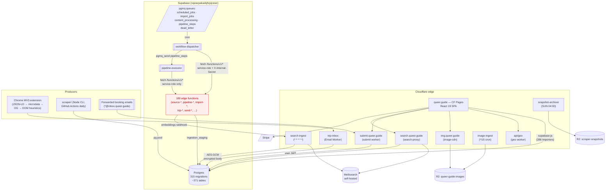

# Queer Guide — Architecture Review

*Audit date: 2026-05-22 · Branch: `main` @ `4fd9b5f5` · Read-only.*

Three parallel evidence-gathering passes (frontend, edge functions, workers+extension) producing independently-verified findings. Every claim below is anchored to `file:line` and the grep that confirms it; nothing is taken on trust from earlier docs (`CLAUDE.md`, `SEARCH_SYSTEM.md`).

The report is ordered by reader urgency, not by component:
1. Live bugs (users see them now)
2. Dead code map (LOC to delete)
3. Phantom workflow registry (operator confusion)
4. **The convergence bridge bug** — newly surfaced; high impact on data quality
5. Architectural drift (where the system will silently desync)
6. Workers reality vs `CLAUDE.md`
7. Recommendations + system diagram

---

## 1 · Live user-facing bugs

Five frontend call sites invoke edge functions that **do not exist in `supabase/functions/`**. Of those, five reach a live route in [`src/routes.tsx`](src/routes.tsx); two are in dead chains.

Detection (deterministic):
```sh
ls supabase/functions/ | grep -v '^_' | sort > /tmp/deployed.txt
grep -rhE "supabase\.functions\.invoke\(['\"][a-z0-9-]+" src/ \
  | grep -oE "['\"][a-z0-9-]+['\"]" | tr -d "'\"" | sort -u > /tmp/invoked.txt
comm -13 /tmp/deployed.txt /tmp/invoked.txt
```

| # | Missing function | Call site | Live route reached | User impact |
|---|------------------|-----------|--------------------|--------------|
| 1 | `create-moderation-flag` | [`src/hooks/useModeration.ts:31`](src/hooks/useModeration.ts) | `ReportDialog` → `ReportButton` → 9 detail pages | **Users click "Report" on harmful content. Nothing reaches moderators.** Trust + safety issue. |
| 2 | `get-wikipedia-info` | [`src/components/location/LocationInfo.tsx:67`](src/components/location/LocationInfo.tsx) | `/places`, `/cities/:slug`, `/countries/:slug` | Wikipedia panel silently empty on every city/country page. (Canonical name is `fetch-wikipedia-data`.) |
| 3 | `auto-tag-content` | [`src/hooks/useAutoTag.ts:75,112,188`](src/hooks/useAutoTag.ts) | Admin → "Suggest tags" in CMS (`AutoTagPanel`, `BatchAutoTagDialog`); used in [`AdminTags.tsx`](src/pages/AdminTags.tsx) | Admin tag-suggestion feature is broken. |
| 4 | `content-automation` | [`src/hooks/useAutomation.ts:366`](src/hooks/useAutomation.ts), [`AdminEditDialog.tsx:308`](src/components/admin/AdminEditDialog.tsx), [`BulkEnrichDialog.tsx:94`](src/components/admin/BulkEnrichDialog.tsx) | 8 `*Detail.parts.tsx` admin-edit flows + CMS bulk-enrich | Admin "automation" actions fail. |
| 5 | `fetch-news` | [`src/pages/AdminNewsSources.tsx:143`](src/pages/AdminNewsSources.tsx) | Admin News Sources page | "Fetch news now" button does nothing. (Replaced by `wf-news-pipeline` cron — UI never updated.) |
| – | `get-stripe-publishable-key` | [`useSecureCredentials.tsx:26`](src/hooks/useSecureCredentials.tsx) | dead chain (orphan, see §2) | none |
| – | `sync-content-links` | [`LinkHealthDashboard.tsx:129`](src/components/admin/LinkHealthDashboard.tsx) | dead chain (orphan, see §2) | none |

**Finding #1 is the most urgent.** Anyone QAing the platform in good faith should treat this as a P0: the "Report" button on news, venues, events, personalities, etc. all silently no-op. The `useModeration` mutation does `await supabase.functions.invoke('create-moderation-flag', ...)` and the call resolves with an error that the dialog swallows.

---

## 2 · Dead code map

Detection: a file is "orphan" if `grep -rln <basename> src/ | grep -v "__tests__\|\.test\."` returns only the file itself. I verified each candidate ≥ 300 LOC independently and walked transitive chains.

### 2.1 Confirmed orphans (delete-safe, with tests)

| Path | LOC | Last commit | Why it's dead |
|------|----:|-------------|---------------|
| [`src/integrations/api/client.ts`](src/integrations/api/client.ts) | 888 | 2026-05-10 | An attempt to replace `@supabase/supabase-js` with a CF Workers gateway. Zero importers. The only matches for `api.functions.invoke` are the docstring examples. |
| [`src/components/App.tsx`](src/components/App.tsx) | 36 | 2026-04-14 | Duplicate "App" component with its own provider stack. The real entry is [`src/App.tsx`](src/App.tsx) → [`main.tsx`](src/main.tsx). |
| [`src/components/admin/AutoCleanDuplicatesTab.tsx`](src/components/admin/AutoCleanDuplicatesTab.tsx) | 861 | 2026-05-21 | Single-self-ref; transitively imports the broken `clean-merge-all-duplicates` call. |
| [`src/components/admin/WorkflowDashboard.tsx`](src/components/admin/WorkflowDashboard.tsx) | 796 | 2026-05-21 | Single-self-ref. Live workflow UI lives in [`AdminPipelines.tsx`](src/pages/AdminPipelines.tsx). |
| [`src/components/admin/EnrichmentDashboard.tsx`](src/components/admin/EnrichmentDashboard.tsx) + [`hooks/useEnrichmentDashboard.ts`](src/hooks/useEnrichmentDashboard.ts) | 720 + ~150 | 2026-05-21 | Paired island. |
| [`src/components/admin/AutomationDashboard.tsx`](src/components/admin/AutomationDashboard.tsx) | 823 | 2026-05-21 | Duplicate of the `automation/` subdir version (also orphan); both unreferenced. |
| [`src/components/admin/automation/`](src/components/admin/automation/) (8 files, ~1,250 LOC total) | 1,248 | 2026-05-21 | Closed island. `grep -rn "admin/automation/" src/` → 0 results outside the subdir. |
| [`src/components/security/CredentialSecurityGuard.tsx`](src/components/security/CredentialSecurityGuard.tsx) | 90 | 2026-04-26 | Imported only by orphan `components/App.tsx`. Exports its own duplicate `useSecureCredentials`. |
| [`src/hooks/useSecureCredentials.tsx`](src/hooks/useSecureCredentials.tsx) | 61 | 2026-02-23 | Single self-ref. Calls broken `get-stripe-publishable-key`. |

Subtotal: **~5,000 LOC** of source + matching test files that the test suite keeps green. Single PR can drop all of it.

### 2.2 Duplicate basenames — pick one

`find src -name '*.tsx' -o -name '*.ts' | xargs basename -s .tsx | xargs basename -s .ts | sort | uniq -d`

| Symbol | Live path | Orphan / shadow path |
|--------|-----------|----------------------|
| `App` | [`src/App.tsx`](src/App.tsx) | [`src/components/App.tsx`](src/components/App.tsx) |
| `client` | [`src/integrations/supabase/client.ts`](src/integrations/supabase/client.ts) | [`src/integrations/api/client.ts`](src/integrations/api/client.ts) |
| `use-toast` | [`src/hooks/use-toast.ts`](src/hooks/use-toast.ts) | [`src/components/ui/use-toast.ts`](src/components/ui/use-toast.ts) |
| `useGroupJoinRequests` | [`hooks/useGroupJoinRequests.ts`](src/hooks/useGroupJoinRequests.ts) | [`hooks/useGroupJoinRequests.tsx`](src/hooks/useGroupJoinRequests.tsx) (shadowed by TS resolution) |
| `AuditTab` | [`admin/search-intelligence/AuditTab.tsx`](src/components/admin/search-intelligence/AuditTab.tsx) | [`admin/pipeline-builder/tabs/AuditTab.tsx`](src/components/admin/pipeline-builder/tabs/AuditTab.tsx) |
| `OverviewTab` | [`admin/search-intelligence/OverviewTab.tsx`](src/components/admin/search-intelligence/OverviewTab.tsx) | [`admin/pipeline-builder/tabs/OverviewTab.tsx`](src/components/admin/pipeline-builder/tabs/OverviewTab.tsx) |
| `VenueCard` | [`components/venues/VenueCard.tsx`](src/components/venues/VenueCard.tsx) | [`components/admin/venues/VenueCard.tsx`](src/components/admin/venues/VenueCard.tsx) |
| `ModerationQueue` | (both orphan) | [`admin/`](src/components/admin/ModerationQueue.tsx), [`cms/`](src/components/cms/ModerationQueue.tsx) |
| `SecurityMonitoringDashboard` | (both orphan) | [`admin/`](src/components/admin/SecurityMonitoringDashboard.tsx), [`security/`](src/components/security/SecurityMonitoringDashboard.tsx) |
| `UrlValidator` | (both orphan) | [`profile/`](src/components/profile/UrlValidator.tsx), [`profile/social/`](src/components/profile/social/UrlValidator.tsx) |
| `ReviewQueue` | [`cms/ReviewQueue.tsx`](src/components/cms/ReviewQueue.tsx) | [`admin/automation/ReviewQueue.tsx`](src/components/admin/automation/ReviewQueue.tsx) |

(`SelectField`, `CreatePostDialog`, `FeedbackCard` collide on basename but are distinct components in distinct contexts — leave alone.)

---

## 3 · Phantom workflow registry

The `workflow_definitions` table accreted three generations of pipeline naming. Every row whose `edge_function` doesn't exist in `supabase/functions/` lands in the `dead_letter` queue when scheduled — see [`workflow-dispatcher/index.ts:180-182`](supabase/functions/workflow-dispatcher/index.ts).

`workflow-dispatcher` is safe (it archives the message and writes `_dead_letter_reason: "Unknown workflow:"`), but operators reading `workflow_definitions` cannot trust the registry as ground truth.

### 3.1 Phantom rows by migration

| Migration | Phantom `edge_function` values | Count |
|-----------|-------------------------------|------:|
| [`20260224193500_seed_workflow_definitions.sql`](supabase/migrations/20260224193500_seed_workflow_definitions.sql) | `fetch-news`, `import-foursquare-venues`, `run-automated-reviews`, `sync-content-links`, `auto-tag-content`, `clean-merge-duplicates`, `import-rest-countries`, `import-airports-data`, `scrape-gaycities-events`, `bulk-scrape-events`, `background-import-manager`, `generate-sitemap`, `ingestion-pipeline` | 13 |
| [`20260228120100_seed_automation_workflows.sql`](supabase/migrations/20260228120100_seed_automation_workflows.sql) | 8× `content-automation` | 8 |
| [`20260406100001_wolfram_workflow_definitions.sql`](supabase/migrations/20260406100001_wolfram_workflow_definitions.sql) | `enrich-wolfram` ×3 | 3 |

A few are explicitly disabled by later migrations (`20260501030000_disable_legacy_import_workflows.sql`, `20260429310000_disable_legacy_fetch_news_cron.sql`), but the rows are still present.

### 3.2 Phantom `pipeline_node_types` + DAG `type` slugs

Detection in [`20260415180000_marketplace_ingestion_pipeline.sql:217+`](supabase/migrations/20260415180000_marketplace_ingestion_pipeline.sql):

| Node slug | Used in pipeline | Edge function dir? |
|-----------|------------------|--------------------|
| `marketplace-relevance` | marketplace-ingestion | NO |
| `marketplace-image-mirror` | marketplace-ingestion | NO |
| `marketplace-link-checker` | marketplace-ingestion | NO |

Plus a set of DAG `type` strings in early pipeline templates ([`20260415160000`](supabase/migrations/20260415160000_hotel_ingestion_pipeline.sql), [`20260415160001`](supabase/migrations/20260415160001_unified_ingestion_pipelines.sql), [`20260415180000`](supabase/migrations/20260415180000_marketplace_ingestion_pipeline.sql)) that have neither a `pipeline_node_types` row nor a built-in handler in `pipeline-executor.handleBuiltInNode`:
`geo-linker`, `quality-scorer`, `source-web-scraper`, `ai-enhancer`, `ai-tagger`, `normalizer`, `validator`, `deduplicator`, `committer`, `review-gate`, `embedding-generator`.

If any of these pipelines are started, `pipeline-executor` falls through to `handleBuiltInNode → default → console.warn` ([`pipeline-executor/index.ts:608`](supabase/functions/pipeline-executor/index.ts)) and the node "completes" with `items_out: 0` — silently no-op. Worth either deleting those pipeline rows or adding real node-type definitions.

---

## 4 · The convergence bridge bug *(new finding)*

[`source-community-submissions/index.ts:51-86`](supabase/functions/source-community-submissions/index.ts) is the bridge that promotes `community_submissions` → `ingestion_staging`. The mapping:

```ts
// line 54
const targetTable = row.content_type === 'venue' ? 'venues' : 'events'
```

The extension and `workers/submit` accept **seven** entity types ([`workers/submit/src/schema.ts:9-17`](workers/submit/src/schema.ts)): `venue`, `event`, `stay`, `marketplace_item`, `news_article`, `place`, `organization`. The submit worker even exports a correct mapping function `entityTypeToTargetTable` ([`schema.ts:113-125`](workers/submit/src/schema.ts)) that returns `venues | events | stays | personalities | null`.

**The bridge function never calls it.** Every non-`venue` submission — `stay`, `marketplace_item`, `news_article`, `place`, `organization` — gets routed to `target_table: 'events'` and then runs through the events pipeline. Downstream `pipeline-validate` rejects them on shape mismatch (events expect `start_datetime`); they pile up in `ingestion_staging` with `disposition='pending'` and never converge to canonical tables.

Confidence: HIGH. The code is six lines, the mapping function exists and is unused, and there is no other writer of `target_table` in the bridge path.

**Recommendation**: replace the conditional with a call to `entityTypeToTargetTable(row.content_type)` (after porting the worker function to Deno) or inline the mapping. P0.

---

## 5 · Architectural drift

### 5.1 Three independent staging contracts

| Dimension | scraper [`schemas.ts`](scraper/src/types/schemas.ts) | extension [`types.ts`](extension/src/shared/types.ts) | submit worker [`schema.ts`](workers/submit/src/schema.ts) |
|---|---|---|---|
| `EntityType` enum | `venue \| event \| place \| stay` (4) | `venue \| event \| stay \| marketplace_item \| news_article \| place \| organization` (7) | same 7 as extension |
| `RawData` policy | **strict** per-entity zod (Venue/Event/Place/Stay); required `name`, `city`, `country`; `geo: {lat, lng}` nested | freeform `Record<string, unknown>` | permissive `z.object({…optional…}).catchall(z.unknown())` |
| Event start | `start_datetime: z.date()` (required) | freeform | `start_date?: string` (rename + retype) |
| Geo | nested `geo: {lat, lng}` | freeform | flat `latitude?`, `longitude?` |
| Title | `name` required | freeform | both `name?` and `title?` optional |

Net effect: the canonical shape lives in the scraper's domain zod; everything else is permissive. `pipeline-normalize` is the de-facto translation layer — and it has **no contract test** that asserts the round trip. A field rename in the worker breaks nothing locally, then surfaces as silent normalize failures in production.

Structural fix: a `packages/staging-contract` (zod + TS) imported by scraper, extension, worker, and `pipeline-normalize`. Add a single contract test per entity type.

### 5.2 Orchestration auth divergence

`workflow-dispatcher` and `pipeline-executor` invoke target edge functions with *different* headers:

| Header | [`workflow-dispatcher.ts:315-324`](supabase/functions/workflow-dispatcher/index.ts) | [`pipeline-executor.ts:296-303`](supabase/functions/pipeline-executor/index.ts) |
|--------|-------------------------------------|-------------------------------------|
| `Authorization: Bearer <service-role>` | ✓ | ✓ |
| `apikey: <service-role>` | ✓ | **✗** |
| `X-Internal-Secret: <secret>` (conditional) | ✓ | **✗** |

`requireInternalOrAdmin` ([`_shared/supabase-client.ts:103-118`](supabase/functions/_shared/supabase-client.ts)) accepts either, so today both paths work. The risk: any future target that tightens to "internal secret only" (no service-role fallback) silently breaks under pipeline-executor while still working under workflow-dispatcher. Pick one convention.

### 5.3 Frontend → edge function call surface is stringly-typed

286 files import `supabase` ([`@/integrations/supabase/client`](src/integrations/supabase/client.ts)). 166 invocations use bare string literals: `supabase.functions.invoke('<name>')`. There's no type-level connection between the literals and the deployed directory. The 5 live broken calls in §1 are direct evidence that this drifts.

Structural fix: generate a `FunctionName` union at build time from `ls supabase/functions/` and type the first arg.

### 5.4 Two App roots, two `useSecureCredentials`

The "Stripe publishable key" feature has *two* implementations (orphan hook + inline export inside the orphan `CredentialSecurityGuard.tsx`) and zero callers. The `components/App.tsx` orphan also imports the only Guard instance. Delete the whole island (see §2.1).

### 5.5 Migration sediment

315 migrations is healthy for a 14-month-old project. The hot tables — `venues` (19 ALTERs), `events` (13), `news_articles` (10), `community_submissions` (10) — show schema evolution, not pathology. But the `workflow_definitions` seed has never been pruned, and the `pipeline_node_types`/`pipeline_definitions` sequence accreted phantom node `type` strings across at least four pipeline rewrites. A single cleanup migration that `DELETE`s phantom rows is overdue.

---

## 6 · Workers reality (8, not 4)

`CLAUDE.md` lists 4 workers. `ls workers/` shows **8**.

| Worker | Hostname | Cron | Storage bindings | Purpose |
|--------|----------|------|------------------|---------|
| `geo` | `queer.guide/api/geo` | — | — | Visitor country from `request.cf.country`. |
| `image-cdn` | `img.queer.guide` | — | R2 `queer-guide-images` (read) | Image origin + on-demand 400px thumb. |
| `image-ingest` | (cron only) | `*/15 * * * *` | R2 `queer-guide-images` (write) | Pulls external URLs → R2; updates `image_assets`. |
| `ingest` | (webhook) | `* * * * *` | KV `EMBED_CACHE`, `INGEST_STATE` | Embeddings + Meilisearch + pgvector upsert. |
| `search-proxy` | `search.queer.guide` | — | KV `EMBED_CACHE`, `SESSION_CACHE` | Personalized hybrid search (owns Meilisearch keys). |
| `snapshot-archiver` | (manual + cron) | `0 4 * * SUN` | R2 `queer-guide-scraper-snapshots` | Drains `scraper_snapshots > 30d` to R2. |
| `submit` | `submit.queer.guide` | — | KV `RATE_LIMIT` | Extension/web submission intake; JWT-verified PostgREST write. |
| `trip-inbox` | Email Worker (`*@inbox.queer.guide`) | — | (none) | AES-GCM-encrypts inbound mail, parses with Workers AI Llama-3.1, writes `trip_inbox_items`. |

Cross-worker shared resources:
- KV `EMBED_CACHE` (`f54d40f6…`) — shared between `ingest` and `search-proxy` (intentional, embeddings reuse)
- R2 `queer-guide-images` — `image-ingest` writes, `image-cdn` reads

No worker-to-worker RPC. Extension boundary is tight: `manifest.json` declares only `activeTab`, `scripting`, `storage`; `externally_connectable` and content script are both narrowly scoped to `queer.guide` origins; no CSP override.

`trip-inbox` produces a *fourth* ingestion sink (`trip_inbox_items`) that does **not** flow through `ingestion_staging`. Worth a sentence in `CLAUDE.md`.

---

## 7 · Recommendations

### P0 — this week (live impact)
1. **Restore `create-moderation-flag`.** Either deploy the function or hide the Report button. Users are silently failing to report harmful content.
2. **Fix `source-community-submissions` target-table mapping** (§4). Replace the binary `venue : events` ternary with the existing `entityTypeToTargetTable` logic. Five entity types are currently rerouted to the wrong canonical table.
3. **Restore or rename `get-wikipedia-info`, `auto-tag-content`, `content-automation`, `fetch-news`.** These power admin features and city/country detail pages.

### P1 — this milestone
4. **Delete the dead code in §2.** ~5,000 LOC + the matching `__tests__` files. One PR.
5. **Cleanup migration** that `DELETE`s the 24+ phantom `workflow_definitions` rows and 3 phantom `pipeline_node_types` rows. Operators get back a trustworthy registry.
6. **`packages/staging-contract`** with zod + a contract test per `EntityType`. Eliminates §5.1.
7. **Unify `pipeline-executor`'s outgoing headers with `workflow-dispatcher`'s** (§5.2). 2-line change.
8. **Sync `CLAUDE.md` workers section** (8, not 4), add the `trip-inbox` sink note.

### P2 — within the quarter
9. **Generate a `FunctionName` union** from `ls supabase/functions/` at build time; type `supabase.functions.invoke(name: FunctionName, …)`. Catches all future §1-style bugs at compile time.
10. **Atomize `SearchResults.tsx` (1,109)** and `UniversalSearchBar.tsx` (983) by entity type. Today any change to events search rebases on venue work.
11. **Per-table type re-exports** of `src/integrations/supabase/types.ts` (18,854 LOC, 54 importers). Move to `src/types/db/<table>.ts`.

### P3 — when convenient
12. `workers/README.md` enumerating all 8 workers with cron + bindings + secret rotation.
13. Document the scraper-vs-edge split for source ingestion (which sources are Node-side, which are Deno-side).
14. Drop the deprecated `corsHeaders` export from [`_shared/supabase-client.ts:31`](supabase/functions/_shared/supabase-client.ts) after migrating remaining importers.

---

## 8 · System diagram



Annotations:
- The "Producers" cluster ends in *four* sinks: `ingestion_staging` (scraper + community submissions, via bridge in §4), `trip_inbox_items` (email — separate sink), `image_assets` (image-ingest), and direct PostgREST writes (extension via submit worker).
- The auth-header divergence between `DISP → FNS` and `EXEC → FNS` is §5.2.

---

## 9 · Open questions

1. **`src/integrations/api/client.ts`** — abandoned migration to a CF Workers API gateway? Or still in flight? If abandoned, confirm safe to delete.
2. **`components/admin/automation/`** — prototype replaced by `pipeline-builder/`, or unfinished?
3. **DLQ current depth.** `workflow-dispatcher.handleHealthCheck` reports it. If high, the phantom workflow rows are accumulating there now.
4. **`pipeline_definitions` vs `workflow_definitions`** — both kept on purpose (DAG vs single-job), or in-flight unification?
5. **`get-stripe-publishable-key`** — was there a dynamic publishable-key fetch in an earlier release? Today [`hooks/useDonations.ts`](src/hooks/useDonations.ts), [`lib/currency.ts`](src/lib/currency.ts), and [`ApiKeysManager.tsx`](src/components/admin/ApiKeysManager.tsx) use a different path. Safe to drop the orphan.
6. **CHANGELOG 1.1.0** lists this milestone's polish work; should the §7 P0/P1 items land as 1.1.1 hotfixes, or wait for 1.2.0?
