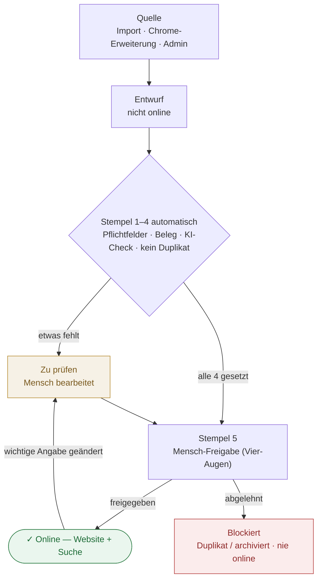

# Personen-Freigabe & Datenqualität (Visum-Prinzip)

**Zweck:** Festhalten, wie Personen ins System kommen, wie sie geprüft werden und **ab wann sie öffentlich online** sind. Dieses Dokument ist die verbindliche „Gedächtnis"-Referenz; der gleiche Inhalt wird im Admin unter **Personen** als Info-Punkt angezeigt (`PersonhoodApprovalInfo`).

## Grundregel

**Online = geprüft.** Eine Person ist auf der Website + in der Suche nur sichtbar, wenn sie **freigegeben** ist. Freigabe funktioniert wie ein Visum: erst wenn **alle Stempel** gesetzt sind, geht die Person online.

## Flussdiagramm

**Kurz:** Person startet als Entwurf → System setzt Stempel 1–4 → ein Mensch prüft und setzt Stempel 5 → erst dann online. Ändert sich später eine wichtige Angabe, fällt sie zurück auf „zu prüfen" (Visum verfällt).

## Die 5 Stempel

| # | Stempel | Wer setzt ihn | Bedeutung |
|---|---|---|---|
| 1 | Pflichtangaben vollständig | automatisch | Name · Geburtsdatum · LGBTQ+-Bezug · Beruf/Tätigkeit · Bild |
| 2 | Beleg vorhanden | automatisch | mindestens eine Quelle (Wikipedia / Wikidata / Link) |
| 3 | KI-Check bestanden | automatisch | keine Widersprüche, Angaben plausibel |
| 4 | Kein Duplikat | automatisch | Person existiert nicht doppelt |
| 5 | Mensch-Freigabe (Vier-Augen) | Mensch | ein:e Prüfer:in bestätigt — **nicht** die Person, die erfasst hat |

Stempel 1–4 setzt das System automatisch. Stempel 5 ist die eigentliche redaktionelle Freigabe.

## Zwei Qualitäts-Regeln (verbindlich)

1. **Vier-Augen-Prinzip.** Wer eine Person erfasst/bearbeitet, darf sie **nicht selbst** freigeben. Ein zweiter Mensch setzt Stempel 5.
2. **Visum verfällt bei Änderung.** Wird später eine wichtige Angabe bearbeitet, fällt die Person automatisch zurück auf **„zu prüfen"** (`needs_attention`) und verschwindet von der Website — bis die Stempel erneut gesetzt sind. Dadurch heißt „online" **immer** „geprüft".

## Sichtbarkeits-Regel (technisch)

Eine Person ist online nur, wenn **alle drei** stimmen:
1. `visibility = 'public'`
2. **nicht** `needs_attention` (zu prüfen)
3. kein Duplikat / nicht archiviert (`duplicate_of_id is null`, `review_status <> 'archived'`)

> ⚠️ **Offener Punkt (Stand 2026-07-16):** `needs_attention` gated die Sichtbarkeit **noch nicht** technisch — nur `visibility` tut das aktuell. Deshalb konnten ungeprüfte Personen öffentlich sein (632 wurden am 2026-07-16 manuell offline genommen, siehe `tools/person-db/docs/needs-attention-gating.md`). **To do:** „Weg B" — `needs_attention is not true` fest in den Suchindexer `search_documents_index_personalities` + optional RLS. Erst dann setzt Regel 2 „Visum verfällt" wirklich automatisch.

## Wie das Gesamtsystem arbeitet

1. **Woher Personen kommen** (alle landen zuerst als **Entwurf**, nicht online):
   - Automatischer Import (Scraper / Datenquellen)
   - Chrome-Erweiterung (Einreichungen von Nutzer:innen)
   - Manuell im Admin
2. **Automatische Prüfung:** Doppelt? Qualität? Vollständig? → sonst Markierung **„zu prüfen"**.
3. **Mensch prüft** → freigeben (online) oder blockieren (Duplikat/archiviert, nie online).
4. **Beruf vs. Tätigkeit:** `profession` = Beruf (Erwerb), `roles[]` = Tätigkeit(en) (z. B. Aktivistin). Getrennte Felder, geteilte Vokabel. Siehe `tools/person-db/docs/roles-field-concept.md`.
5. **Meilensteine:** bei einer Person **nur per Auswahl** verknüpfbar (kein Freitext). Neue Meilensteine nur in der Meilenstein-Verwaltung anlegen.
6. **Prüf-Werkzeug:** `tools/person-db` — eigenständiges, **nur-lesendes** Werkzeug für den täglichen Personen-Check (Dashboard, Liste, Detail, KI-Check, Duplikate, Ampel). Schreibt nichts; echte Änderungen laufen über den Admin.

## Rollen

- **Erfasser:in** — legt Personen an / bearbeitet Angaben.
- **Prüfer:in** — setzt Stempel 5 (Freigabe). Muss eine andere Person sein (Vier-Augen).

## Umsetzungsstand

- ✅ Konzept + dieses Dokument (Gedächtnis).
- ✅ Beruf/Tätigkeit getrennt; Meilenstein nur per Auswahl (Werkzeug).
- ⏳ Stempelkarte (Felder pro Person: welcher Stempel, von wem, wann) — noch nicht gebaut.
- ⏳ Automatische Stempel 1–4 + Freigabe-Knopf (Stempel 5) + Vier-Augen — noch nicht gebaut.
- ⏳ Visum-Verfall (needs_attention gated Sichtbarkeit, „Weg B") — noch nicht gebaut.
